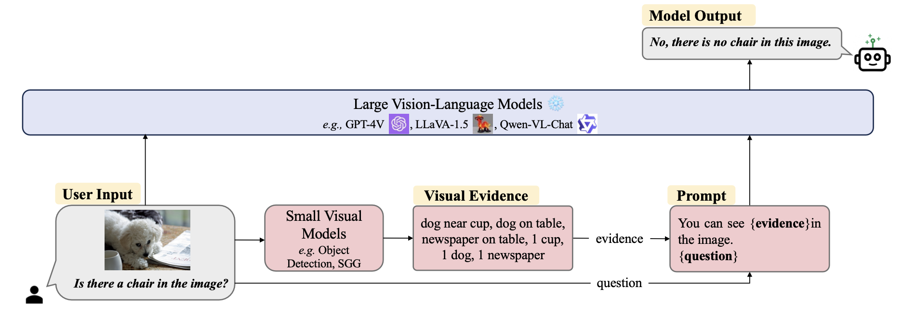

<h1 align="center">
  Visual Evidence Prompting Mitigates Hallucinations in Large Vision-Language Models
</h1>

<p align="center">
  <a href="https://aclanthology.org/2025.acl-long.205/"></a>
</p>

<h4 align="center">
  Official repository for Visual Evidence Prompting (VEP), ACL 2025 Long Paper.
</h4>

---

## 📌 Abstract

Large Vision-Language Models (LVLMs) have shown impressive progress in multimodal understanding and general-purpose reasoning. Despite these advances, they still suffer from hallucination, where the generated responses contain descriptions that are inconsistent with the visual content. Our investigation shows that such hallucinations are often rooted in insufficient fine-grained visual understanding, especially when models encounter visually or semantically similar elements, such as *bicycle vs. motorcycle* or *baseball bat vs. baseball*.

In this work, we propose **Visual Evidence Prompting (VEP)**, a simple and training-free framework that mitigates hallucinations by complementing LVLMs with external visual evidence extracted from small expert vision models. While LVLMs are strong generalists with powerful language understanding and reasoning abilities, traditional vision models are often reliable specialists for specific visual perception tasks. VEP converts the high-confidence outputs of these expert models into natural-language evidence and provides them as explicit contextual prompts for LVLMs.

By introducing symbolic and semantically dense visual evidence, VEP offers more direct and reliable reasoning anchors beyond the continuous visual features encoded by the vision encoder. Extensive experiments across multiple benchmarks and LVLMs demonstrate that our method effectively reduces hallucinations without compromising general multimodal understanding. Further analysis shows that visual evidence helps rectify the model’s attribution and attention over image content, suppressing incorrect activations while enhancing correct ones.


---

## 🛠️ Method

**Visual Evidence Prompting (VEP)** is a training-free framework that combines small expert vision models with LVLMs to mitigate hallucinations.

Conventional LVLM inference generates an answer based on \(P(A|Q,I)\), where the model relies on visual features passed through the vision encoder and projector. However, fine-grained visual details may be lost or underrepresented in this process, making the model vulnerable to visual confusion and language priors.

VEP introduces external visual evidence \(VE\) extracted by small expert vision models and reformulates the inference process as \(P(A|Q,I,VE)\). The extracted evidence, such as objects, attributes, relations, or OCR results, is converted into natural-language prompts and provided to the LVLM as explicit semantic anchors.

<p align="center">
  
  <br>
  <em>Overview of Visual Evidence Prompting.</em>
</p>

---

## 🚀 Inference

We provide inference code based on LLaVA. Please refer to:

```bash
LLaVA/llava1.5_inference_loop_AMBER.py
```

The inference process on other models and datasets follows a similar pipeline.

The offline-extracted visual evidence is provided in:

```bash
visual_evidence/
```

In practical deployment, visual evidence can be extracted online during inference. In this repository, we provide offline-extracted visual evidence mainly for research convenience, while the latency reported in the paper is evaluated under the online extraction setting.

---


## 🔍 Internal Interpretability Analysis

The code in `path_patching/` provides our core implementation for internal interpretability analysis based on path patching and logit lens, which traces the information flow within LVLM and analyzes how visual evidence affects the model’s internal behavior.

---


## 🖋️ Citation

If you find our work useful for your research, please consider citing:

```bibtex
@inproceedings{li2025visual,
  title={Visual Evidence Prompting Mitigates Hallucinations in Large Vision-Language Models},
  author={Li, Wei and Huang, Zhen and Li, Houqiang and Lu, Le and Lu, Yang and Tian, Xinmei and Shen, Xu and Ye, Jieping},
  booktitle={Proceedings of the 63rd Annual Meeting of the Association for Computational Linguistics (Volume 1: Long Papers)},
  pages={4048--4080},
  year={2025}
}
```
